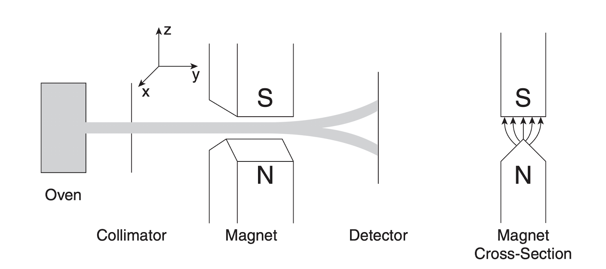

# Quantum Mechanics

These notes will be the following the order of David H. Mclntyre textbook, as well as "The theoretical minimum of quantum mechanics".

We will start with the stern Gerlach experiment, then follow it by understanding the Hilbert spaces and the matrix notation.

---

### Classical vs Quantum

The main difference between classical and quantum mechanics is that, in a classical world, the relationship between the state of a system and the result we get from measuring the system is trivial, it's so actually trivial that we don't really consider them to be different things, we classicaly treat the momentum of an object and the result of measuring the momentum of the object are the same thing (duh?).

In Quantum mechanics however, that is not the case!  
States and the measurements of states are two different things.

All books (I have read at least) start by studying the spin of a system since its the most basic, yet the most quantum of all systems. Any attempt to visualize what a spin is, however, (e.g. using an arrow in space pointing to a direction) will badly miss the point.

So what is spin? spin is an intrinsic property of a system, that is denoted by $\sigma$. It's a degree of freedom that is associated with a sense of direction in space. We figured out that spin seems to be a thing after the Stern-Gerlach experiment that took place in 1922. The experiment consists of an oven that produced a beam of neutral atoms (Silver atoms), and it was observed that this beam of atoms splits when it passes through a magnetic field. Roughly half the atoms go upwards and the other half goes downwards with an equal magnitude of deflection, when the magnetic field is applied vertically.

McIntyre Fig.1

Why is this odd? because if spin of these neutral particles was a _classical spin_ - by that I mean that silver atoms are spinning around axis resulting in a magnetic moment in a direction that we can deduce using the right hand rule - then we would expect to have a distribution of deflections, rather than those two mere values of deflection up and down.

Let alone the fact that to if we were to get the amount of deflection measured in the Stern-Gerlach experiment with a _classical spin_, the surface of the silver atoms (ignoring the fact ath i am treating them as spheres now) would have to be moving at a speed greater than $c$.

So spin is something more intrinsic, and it's not a vector in space, because if it was a vector we would be able to measure all it's components simultaneously, but we can't.

---

### Born Rule

$$P = \vert<outcome \vert \psi>\vert^2$$
